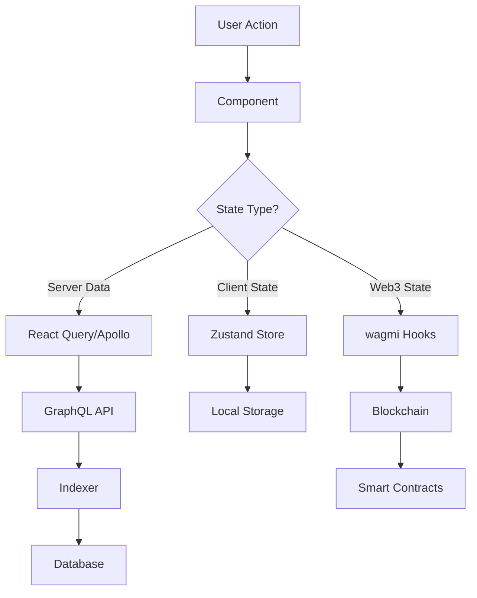

# HyperPredict Frontend Architecture

## Overview

HyperPredict is a modern, production-ready frontend for the Hyperliquid-based prediction markets protocol. Built with Next.js 14, TypeScript, and a cutting-edge tech stack, it provides a professional trading interface with real-time updates and advanced analytics.

## Tech Stack

### Core Framework
- **Next.js 14** - App Router with SSR/SSG capabilities
- **TypeScript** - Full type safety across the application
- **pnpm** - Fast, efficient package management

### UI/UX
- **TailwindCSS** - Utility-first CSS framework
- **shadcn/ui** - High-quality, accessible component library
- **Framer Motion** - Smooth animations and micro-interactions
- **Lucide React** - Consistent icon system

### Web3 Integration
- **wagmi v2** - React hooks for Ethereum
- **viem** - TypeScript interface for Ethereum
- **RainbowKit** - Beautiful wallet connection UI
- **ConnectKit** - Alternative wallet connection (fallback)

### Data Layer
- **Apollo Client** - GraphQL client with caching
- **React Query (TanStack Query)** - Server state management
- **Zustand** - Client-side state management
- **SWR** - Data fetching with revalidation

### Charts & Visualization
- **Recharts** - Composable chart library
- **D3.js** - Custom data visualizations
- **Victory** - Modular charting components (fallback)

### Forms & Validation
- **React Hook Form** - Performant forms with minimal re-renders
- **Zod** - TypeScript-first schema validation
- **@hookform/resolvers** - Integration layer

### Development Tools
- **ESLint** - Code linting
- **Prettier** - Code formatting
- **Husky** - Git hooks
- **lint-staged** - Run linters on staged files

## Project Structure

```
packages/frontend/
├── README.md
├── package.json
├── tsconfig.json
├── tailwind.config.js
├── next.config.js
├── .env.local.example
├── .eslintrc.json
├── .prettierrc
├── docs/
│   ├── architecture.md          # This file
│   ├── deployment.md           # Deployment instructions
│   └── development.md          # Development guidelines
├── public/
│   ├── icons/                  # App icons and favicons
│   ├── images/                 # Static images
│   └── logos/                  # Brand assets
├── src/
│   ├── app/                    # Next.js App Router
│   │   ├── layout.tsx          # Root layout
│   │   ├── page.tsx           # Home page
│   │   ├── loading.tsx        # Global loading UI
│   │   ├── error.tsx          # Global error UI
│   │   ├── not-found.tsx      # 404 page
│   │   ├── globals.css        # Global styles
│   │   ├── providers.tsx      # App providers wrapper
│   │   ├── (dashboard)/       # Dashboard layout group
│   │   │   ├── layout.tsx     # Dashboard layout
│   │   │   ├── page.tsx       # Dashboard home
│   │   │   ├── markets/       # Markets section
│   │   │   │   ├── page.tsx   # Markets list
│   │   │   │   └── [id]/      # Individual market
│   │   │   │       ├── page.tsx
│   │   │   │       └── loading.tsx
│   │   │   ├── portfolio/     # User portfolio
│   │   │   │   └── page.tsx
│   │   │   ├── analytics/     # Analytics dashboard
│   │   │   │   └── page.tsx
│   │   │   └── leaderboard/   # Leaderboard
│   │   │       └── page.tsx
│   │   ├── create/            # Market creation flow
│   │   │   ├── layout.tsx     # Creation layout
│   │   │   ├── page.tsx       # Step 1: Basic info
│   │   │   ├── predicate/     # Step 2: Predicate setup
│   │   │   │   └── page.tsx
│   │   │   ├── timing/        # Step 3: Timing configuration
│   │   │   │   └── page.tsx
│   │   │   ├── economics/     # Step 4: Economics
│   │   │   │   └── page.tsx
│   │   │   └── review/        # Step 5: Review & deploy
│   │   │       └── page.tsx
│   │   └── api/               # API routes
│   │       ├── health/        # Health check
│   │       └── webhooks/      # Webhook handlers
│   ├── components/            # React components
│   │   ├── ui/               # Base UI components (shadcn/ui)
│   │   │   ├── button.tsx
│   │   │   ├── card.tsx
│   │   │   ├── input.tsx
│   │   │   ├── dialog.tsx
│   │   │   ├── table.tsx
│   │   │   ├── chart.tsx
│   │   │   └── index.ts      # Barrel exports
│   │   ├── layout/           # Layout components
│   │   │   ├── header.tsx
│   │   │   ├── sidebar.tsx
│   │   │   ├── footer.tsx
│   │   │   └── navigation.tsx
│   │   ├── web3/             # Web3-specific components
│   │   │   ├── connect-button.tsx
│   │   │   ├── wallet-info.tsx
│   │   │   ├── network-switcher.tsx
│   │   │   └── transaction-toast.tsx
│   │   ├── markets/          # Market-related components
│   │   │   ├── market-card.tsx
│   │   │   ├── market-grid.tsx
│   │   │   ├── market-filters.tsx
│   │   │   ├── market-detail/
│   │   │   │   ├── market-header.tsx
│   │   │   │   ├── trading-interface.tsx
│   │   │   │   ├── market-chart.tsx
│   │   │   │   ├── order-book.tsx
│   │   │   │   ├── position-manager.tsx
│   │   │   │   └── activity-feed.tsx
│   │   │   └── creation/
│   │   │       ├── step-indicator.tsx
│   │   │       ├── basic-info-form.tsx
│   │   │       ├── predicate-form.tsx
│   │   │       ├── timing-form.tsx
│   │   │       ├── economics-form.tsx
│   │   │       └── review-summary.tsx
│   │   ├── charts/           # Chart components
│   │   │   ├── probability-chart.tsx
│   │   │   ├── volume-chart.tsx
│   │   │   ├── pnl-chart.tsx
│   │   │   ├── market-depth.tsx
│   │   │   └── analytics-charts.tsx
│   │   ├── portfolio/        # Portfolio components
│   │   │   ├── position-card.tsx
│   │   │   ├── positions-table.tsx
│   │   │   ├── pnl-summary.tsx
│   │   │   └── claim-rewards.tsx
│   │   ├── analytics/        # Analytics components
│   │   │   ├── metrics-grid.tsx
│   │   │   ├── performance-chart.tsx
│   │   │   ├── market-stats.tsx
│   │   │   └── user-stats.tsx
│   │   └── common/           # Common/shared components
│   │       ├── loading-spinner.tsx
│   │       ├── error-boundary.tsx
│   │       ├── data-table.tsx
│   │       ├── search-bar.tsx
│   │       ├── pagination.tsx
│   │       └── theme-toggle.tsx
│   ├── hooks/                # Custom React hooks
│   │   ├── use-market.ts     # Market data hooks
│   │   ├── use-markets.ts    # Markets list hooks
│   │   ├── use-positions.ts  # User positions hooks
│   │   ├── use-user.ts       # User data hooks
│   │   ├── use-analytics.ts  # Analytics hooks
│   │   ├── use-trading.ts    # Trading operations hooks
│   │   ├── use-contract.ts   # Contract interaction hooks
│   │   ├── use-websocket.ts  # WebSocket connection hooks
│   │   ├── use-local-storage.ts # Local storage utility
│   │   └── use-debounce.ts   # Debouncing utility
│   ├── lib/                  # Utility libraries
│   │   ├── utils.ts          # General utilities
│   │   ├── cn.ts            # Class name utility
│   │   ├── constants.ts      # App constants
│   │   ├── config.ts         # App configuration
│   │   ├── env.ts           # Environment variables
│   │   ├── web3/            # Web3 utilities
│   │   │   ├── config.ts    # wagmi configuration
│   │   │   ├── contracts.ts # Contract addresses & ABIs
│   │   │   ├── chains.ts    # Chain configurations
│   │   │   └── utils.ts     # Web3 utility functions
│   │   ├── graphql/         # GraphQL utilities
│   │   │   ├── client.ts    # Apollo client setup
│   │   │   ├── queries.ts   # GraphQL queries
│   │   │   ├── mutations.ts # GraphQL mutations
│   │   │   └── fragments.ts # GraphQL fragments
│   │   ├── analytics/       # Analytics utilities
│   │   │   ├── calculations.ts
│   │   │   ├── formatters.ts
│   │   │   └── aggregations.ts
│   │   └── validations/     # Validation schemas
│   │       ├── market.ts    # Market validation
│   │       ├── user.ts      # User validation
│   │       └── forms.ts     # Form validation schemas
│   ├── stores/              # State management
│   │   ├── use-app-store.ts # Global app state
│   │   ├── use-market-store.ts # Market-specific state
│   │   ├── use-user-store.ts # User state
│   │   ├── use-trading-store.ts # Trading state
│   │   └── use-ui-store.ts  # UI state (modals, etc.)
│   ├── services/            # External service integrations
│   │   ├── api.ts           # REST API client
│   │   ├── websocket.ts     # WebSocket service
│   │   ├── ipfs.ts          # IPFS integration
│   │   └── notifications.ts # Push notifications
│   └── types/               # TypeScript type definitions
│       ├── api.ts           # API response types
│       ├── market.ts        # Market-related types
│       ├── user.ts          # User-related types
│       ├── web3.ts          # Web3-related types
│       ├── chart.ts         # Chart data types
│       └── global.d.ts      # Global type declarations
├── codegen.yml              # GraphQL code generation
└── .graphqlrc.yml          # GraphQL config
```

## State Management Architecture

### State Organization

The application uses a hybrid state management approach:

#### 1. Server State (React Query + Apollo)
- **Markets data** - Cached with 30s stale time
- **User positions** - Cached with 10s stale time
- **Protocol analytics** - Cached with 5min stale time
- **Real-time updates** - WebSocket subscriptions

#### 2. Client State (Zustand)
- **UI state** - Modals, sidebars, themes
- **Trading state** - Current market, selected outcome, amounts
- **User preferences** - Settings, favorites, filters
- **App state** - Loading states, errors, notifications

#### 3. Web3 State (wagmi)
- **Wallet connection** - Account, chain, balance
- **Contract interactions** - Transaction states
- **Network state** - Chain switching, RPC status

### Data Flow



## Service Layer Architecture

### GraphQL Client (Apollo)

```typescript
// lib/graphql/client.ts
const client = new ApolloClient({
  uri: process.env.NEXT_PUBLIC_GRAPHQL_ENDPOINT,
  cache: new InMemoryCache({
    typePolicies: {
      Market: {
        fields: {
          deposits: { merge: false },
          claims: { merge: false }
        }
      }
    }
  }),
  defaultOptions: {
    watchQuery: { errorPolicy: 'all' },
    query: { errorPolicy: 'all' }
  }
});
```

### Web3 Configuration (wagmi)

```typescript
// lib/web3/config.ts
export const config = createConfig({
  chains: [arbitrumSepolia, arbitrum],
  transports: {
    [arbitrumSepolia.id]: http(process.env.NEXT_PUBLIC_ARBITRUM_SEPOLIA_RPC),
    [arbitrum.id]: http(process.env.NEXT_PUBLIC_ARBITRUM_RPC)
  },
  connectors: [
    injected(),
    walletConnect({ projectId: process.env.NEXT_PUBLIC_WC_PROJECT_ID! }),
    coinbaseWallet({ appName: 'HyperPredict' })
  ],
  ssr: true
});
```

### Real-time Updates (WebSocket)

```typescript
// services/websocket.ts
class WebSocketService {
  private ws: WebSocket | null = null;
  private subscriptions = new Map<string, Set<Function>>();

  subscribe(topic: string, callback: Function) {
    if (!this.subscriptions.has(topic)) {
      this.subscriptions.set(topic, new Set());
    }
    this.subscriptions.get(topic)!.add(callback);
    
    // Send subscription to server
    this.send({ type: 'subscribe', topic });
  }
}
```

## Component Architecture

### Component Hierarchy

```
App (providers)
├── Layout (header, sidebar, footer)
├── Dashboard
│   ├── MarketGrid
│   │   └── MarketCard[]
│   ├── ActivityFeed
│   └── MetricsOverview
├── MarketDetail
│   ├── MarketHeader
│   ├── TradingInterface
│   ├── MarketChart
│   ├── OrderBook
│   └── PositionManager
└── Portfolio
    ├── PositionsTable
    ├── PnLSummary
    └── ClaimRewards
```

### Design System Components

All UI components follow the shadcn/ui pattern:
- **Compound components** for complex interactions
- **Polymorphic components** using `asChild` pattern
- **Accessible by default** with proper ARIA attributes
- **Theme-aware** with CSS variables
- **Responsive** with mobile-first design

## Data Architecture

### GraphQL Schema Integration

The frontend consumes the indexer's GraphQL schema with full TypeScript integration:

```typescript
// Generated types from codegen
export type Market = {
  id: string;
  title: string;
  description: string;
  poolYes: string;
  poolNo: string;
  totalPool: string;
  resolved: boolean;
  // ... other fields
};

export type MarketsQuery = {
  markets: Market[];
  protocol: Protocol;
};
```

### Contract Integration

Smart contract interactions are handled through generated ABIs and type-safe hooks:

```typescript
// hooks/use-trading.ts
export function useMarketDeposit(marketAddress: `0x${string}`) {
  return useWriteContract({
    abi: ParimutuelMarketABI,
    address: marketAddress,
    functionName: 'deposit'
  });
}
```

## Performance Optimizations

### Code Splitting
- **Route-based splitting** - Each page is a separate chunk
- **Component lazy loading** - Heavy components loaded on demand
- **Dynamic imports** - Chart libraries loaded when needed

### Caching Strategy
- **Static generation** - Landing pages and docs
- **Incremental regeneration** - Market list with 60s revalidation
- **Client-side caching** - Apollo cache + React Query
- **Service worker** - Offline support for critical paths

### Bundle Optimization
- **Tree shaking** - Remove unused code
- **Module federation** - Share common dependencies
- **Compression** - Gzip/Brotli for all assets
- **Image optimization** - Next.js Image component

## Security Considerations

### Web3 Security
- **Transaction simulation** before execution
- **Slippage protection** for market trades
- **Gas estimation** with safety margins
- **Contract verification** against known ABIs

### Data Security
- **Input sanitization** on all user inputs
- **XSS protection** through proper escaping
- **CORS policies** for API endpoints
- **Environment variables** for sensitive data

### User Security
- **Wallet connection verification**
- **Transaction signing confirmation**
- **Phishing protection** warnings
- **Local storage encryption** for sensitive data

## Deployment Architecture

### Build Process
1. **Type checking** - TypeScript compilation
2. **Linting** - ESLint + Prettier
3. **Testing** - Unit + integration tests
4. **Building** - Next.js production build
5. **Optimization** - Bundle analysis + compression

### Environment Configuration
- **Development** - Local with mocked data
- **Staging** - Testnet with real contracts
- **Production** - Mainnet deployment

### Monitoring & Analytics
- **Error tracking** - Sentry integration
- **Performance monitoring** - Web Vitals
- **User analytics** - Privacy-first tracking
- **Transaction monitoring** - Success/failure rates

## Development Workflow

### Getting Started
```bash
# Install dependencies
pnpm install

# Set up environment
cp .env.local.example .env.local
# Edit .env.local with your configuration

# Generate GraphQL types
pnpm codegen

# Start development server
pnpm dev
```

### Available Scripts
```bash
pnpm dev          # Start development server
pnpm build        # Build for production
pnpm start        # Start production server
pnpm lint         # Run ESLint
pnpm type-check   # Run TypeScript compiler
pnpm test         # Run tests
pnpm codegen      # Generate GraphQL types
```

### Code Standards
- **TypeScript** - Strict mode enabled
- **ESLint** - Airbnb config with custom rules
- **Prettier** - Consistent code formatting
- **Husky** - Pre-commit hooks for quality

This architecture provides a solid foundation for building a production-ready prediction markets frontend that can scale with your protocol's growth while maintaining high performance and user experience standards.